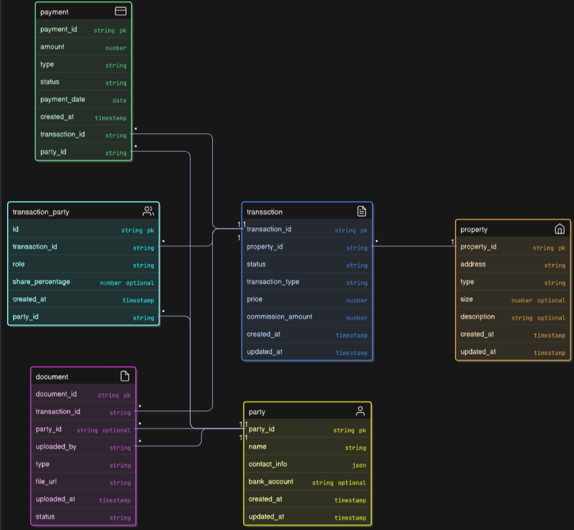

---
# System Design Document

## 1. System Architecture and Data Model

### Architecture

The system is built using a **layered architecture**:

- **API Layer**: Exposes REST endpoints to manage transactions, parties, payments, and documents. Handles validation and authentication.
- **Service Layer**: Encapsulates business logic (transaction lifecycle, commission calculation, payment tracking, document linking).
- **Repository Layer**: Handles database operations via SQL.
- **Database**: Relational database (PostgreSQL) for structured and reliable storage.

> This separation ensures maintainability, testability, and extensibility. If commission rules change or new workflows are added, only the service layer is updated while API and DB remain stable.

### Data Model

We identified **six core entities**:

| Entity             | Description                                                                 |
| **Property**       | Represents the real estate being sold or rented.                            
| **Party**          | Generalized entity for all stakeholders (agency, agents, buyers, sellers, tenants). 
| **Transaction**    | Represents a deal (sale or rental), tracks lifecycle stages (agreement → earnest money → title deed → completed). 
| **TransactionParty** | Joins transactions with parties and specifies their role (listing agent, selling agent, buyer, seller, tenant). 
| **Payment**        | Records financial flows (earnest deposits, commission payouts).             
| **Document**       | Stores receipts, agreements, and title deed proofs linked to a transaction. 

#### Data Model Diagram

#### Why This Model?

- **Normalized structure**: Avoids duplication by keeping Party generalized.
- **Extensible**: Commission rules can be applied using `TransactionParty.role` without schema changes.
- **Traceable**: Every financial/payment action can be linked to supporting documents.

#### Alternative Approaches Considered and Rejected

- **Separate Agent and Client tables**: Rejected in favor of a single Party table to reduce duplication and simplify joins.
- **Storing commissions directly inside Transaction**: Rejected because commissions depend on roles; storing them in Payments provides better flexibility and auditability.

---

## 2. Riskiest or Most Challenging Aspect

The riskiest aspect of the design is **commission calculation and distribution**.

**Why risky?**

Commission rules often change, can vary by scenario, and may involve exceptions (special contracts, referral bonuses, promotional campaigns). Hardcoding these rules would make the system inflexible and error-prone.

**Solutions :**

- Designed a dedicated **Commission Service** that applies rules based on `TransactionParty.role`.
  - All commission logic is kept in one place (the Commission Service), so it’s easy to update or swap for a configurable rules engine later. For example, you could allow admins to update commission splits by entering new values through an input form or uploading a settings file, instead of changing code. This makes the system flexible and user-friendly for future policy changes.
- Added support for `share_percentage` in TransactionParty to allow overrides without breaking the core logic.
- Enforced validation to ensure commission splits always total 100% (avoids imbalance).

> This makes the system robust to current requirements but also adaptable to future complexities.

---

